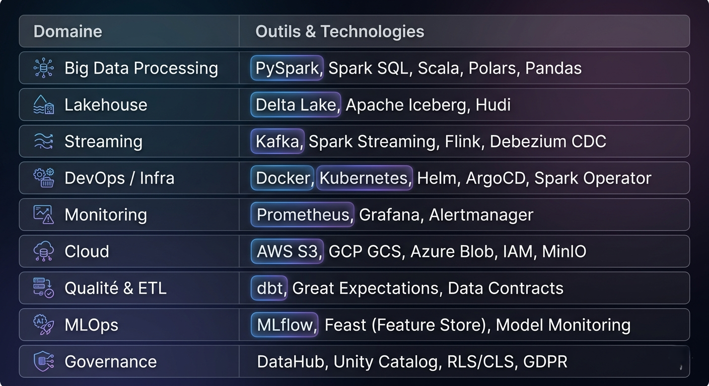
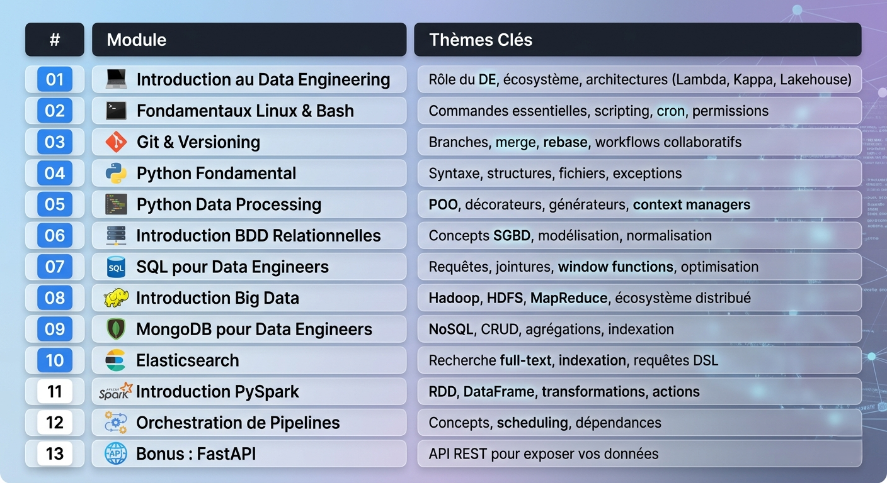
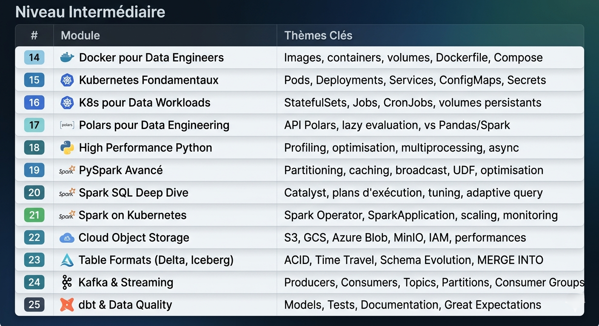
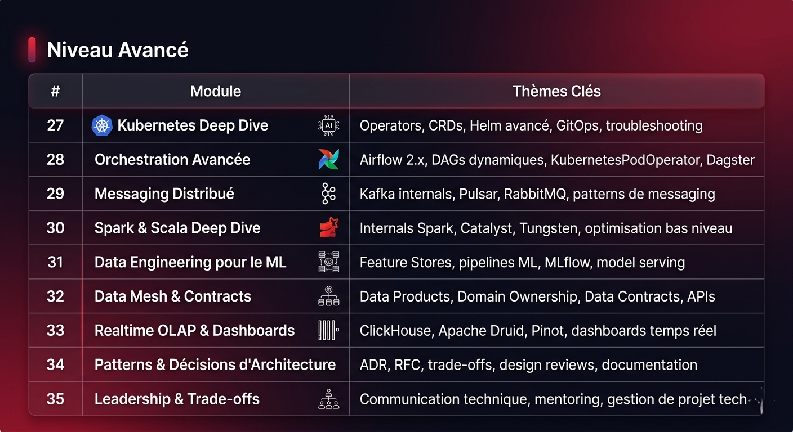
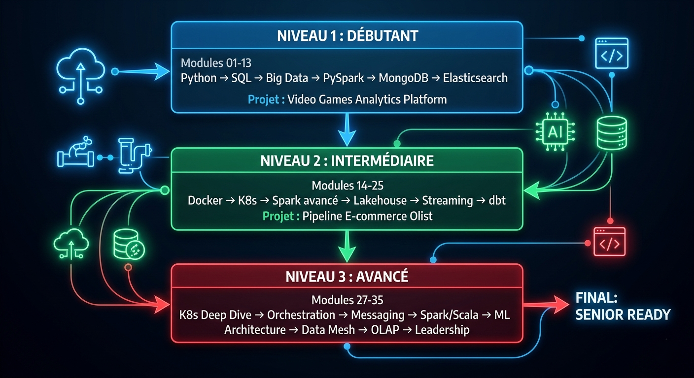
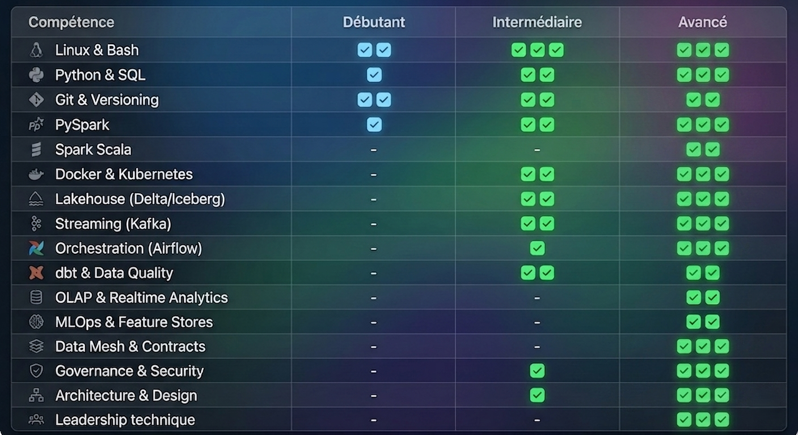

  <h2>🚀 Bootcamp Data Engineering </h2>
  <h1>From Zero to Hero</h1>
  <h3>Devenez un Data Engineer opérationnel, prêt pour l'entreprise.</h3>

---

## 🎯 Pourquoi choisir ce Bootcamp ?

Ce programme a été conçu par des Data Engineers expérimentés, en se concentrant sur les **exigences réelles du marché**.  
Il vous accompagne de manière progressive vers un niveau **professionnel – Senior Ready**.

### ✔ Ce que vous allez maîtriser

- **Outils industriels** : Spark 3.x, Kafka, Flink, Docker, Kubernetes, dbt, Lakehouse (Delta/Iceberg).
- **Architectures modernes** : Médaillon (Bronze/Silver/Gold), Kappa, Lambda, Data Lakehouse, Data Mesh.
- **Compétences d'ingénierie** : optimisation, gouvernance, orchestration, CI/CD, cloud.
- **Industrialisation** : création de pipelines batch et streaming totalement opérationnels.
- **Leadership technique** : RFC, Design Reviews, ADR, pensée architecturale.

---

## 👥 À qui s'adresse ce Bootcamp ?

- **Étudiants / Développeurs** voulant entrer dans le monde du Big Data.
- **Analystes BI** souhaitant évoluer vers le Data Engineering moderne.
- **Professionnels expérimentés** voulant structurer une plateforme Data complète.
- **Architectes & Managers** cherchant à comprendre les technos Data modernes.

---

## 🛠️ Votre Boîte à Outils Data Engineering

  

---

# 📘 Structure Complète du Programme (3 Niveaux)

La progression est organisée selon un parcours **pédagogique optimal** :

---

# 🟦 Niveau 1 : Débutant – Fondations & Premiers Pipelines

### 🎯 Objectif  
Construire des bases solides en Python, SQL, systèmes distribués et premiers pipelines.

### 📚 Modules

  

### 🎮 Projet Intégrateur : Video Games Analytics Platform

> **Pipeline complet** : Kaggle CSV → Web Scraping → DuckDB + Elasticsearch → PySpark → FastAPI → Streamlit Dashboard
>
> [🚀 Accéder au projet](notebooks/beginner/projet_debutant.ipynb)

> **🎯 Résultat :** Capable de construire un pipeline data de bout en bout, de l'ingestion au dashboard.

---

# 🟩 Niveau 2 : Intermédiaire – Industrialisation & Lakehouse

### 🎯 Objectif  
Maîtriser les technologies indispensables en entreprise : Docker, Kubernetes, Spark avancé, Lakehouse, streaming, orchestration.

### 📚 Modules

  

### 📦 Projet Intégrateur : Pipeline E-commerce Olist

> **Pipeline Lakehouse** : Kafka → Spark Streaming → Delta Lake → dbt → Dashboard
>
> [🚀 Accéder au projet](notebooks/intermediate/26_projet_integrateur.ipynb)

> **🎯 Résultat :** Déployer un job Spark sur Kubernetes, stocker en Delta, orchestrer & monitorer.

---

# 🟥 Niveau 3 : Avancé – Architecture, Optimisation & Seniority

### 🎯 Objectif  
Atteindre le niveau "Senior Data Engineer / Architecte Data" avec une maîtrise des systèmes distribués, de l'architecture et du leadership technique.

### 📚 Modules

> **🎯 Résultat :** Capable de concevoir et défendre une architecture Data complète, mener des design reviews, et guider une équipe technique.

---

# 📊 Vue d'Ensemble du Parcours

  

---

# 🏆 Compétences Acquises par Niveau

  

---

# 🚀 Démarrer le Bootcamp

👉 Cliquez dans le menu de gauche pour ouvrir le premier module, ou choisissez votre point d'entrée :

  <a href="notebooks/beginner/01_intro_data_engineering.ipynb" style="background: linear-gradient(135deg, #3b82f6, #1d4ed8); color: white; padding: 15px 30px; text-decoration: none; font-size: 16px; border-radius: 10px; font-weight: 600; box-shadow: 0 4px 15px rgba(59, 130, 246, 0.3);">
    🟦 Niveau Débutant
  </a>
  <a href="notebooks/intermediate/14_docker_for_data_engineers.ipynb" style="background: linear-gradient(135deg, #22c55e, #16a34a); color: white; padding: 15px 30px; text-decoration: none; font-size: 16px; border-radius: 10px; font-weight: 600; box-shadow: 0 4px 15px rgba(34, 197, 94, 0.3);">
    🟩 Niveau Intermédiaire
  </a>
  <a href="notebooks/advanced/27_kubernetes_deep_dive.ipynb" style="background: linear-gradient(135deg, #ef4444, #dc2626); color: white; padding: 15px 30px; text-decoration: none; font-size: 16px; border-radius: 10px; font-weight: 600; box-shadow: 0 4px 15px rgba(239, 68, 68, 0.3);">
    🟥 Niveau Avancé
  </a>

---

## 💡 Conseils pour Réussir

1. **Suivez l'ordre** : Les modules sont conçus pour être suivis séquentiellement.
2. **Pratiquez** : Faites tous les exercices et projets intégrateurs.
3. **Expérimentez** : Modifiez le code, cassez des choses, apprenez des erreurs.
4. **Documentez** : Prenez des notes, créez votre propre documentation.
5. **Construisez votre portfolio** : Les projets intégrateurs sont présentables en entretien.

---

## 🎉 Bonne montée en compétence !  

Vous êtes maintenant prêt à progresser étape par étape jusqu'au niveau **Senior Data Engineer**.
